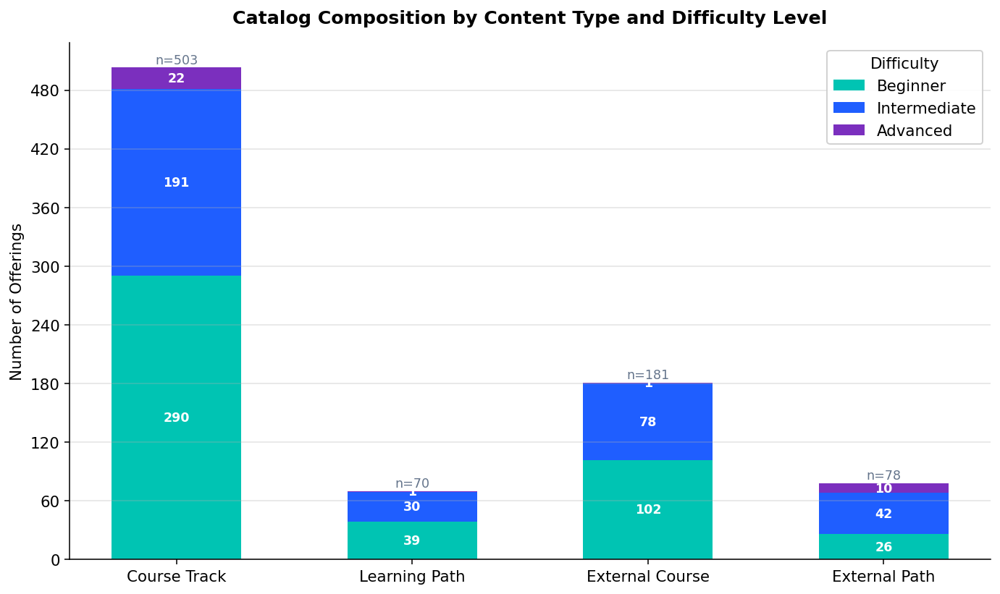
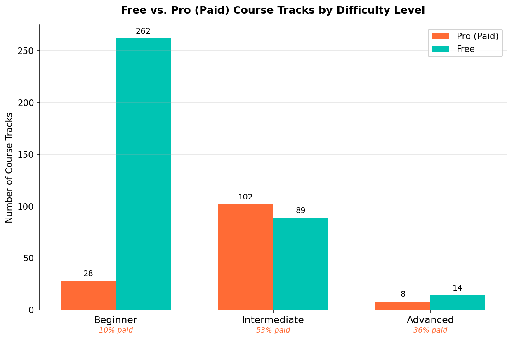
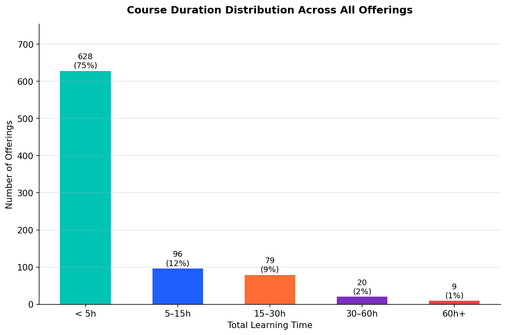
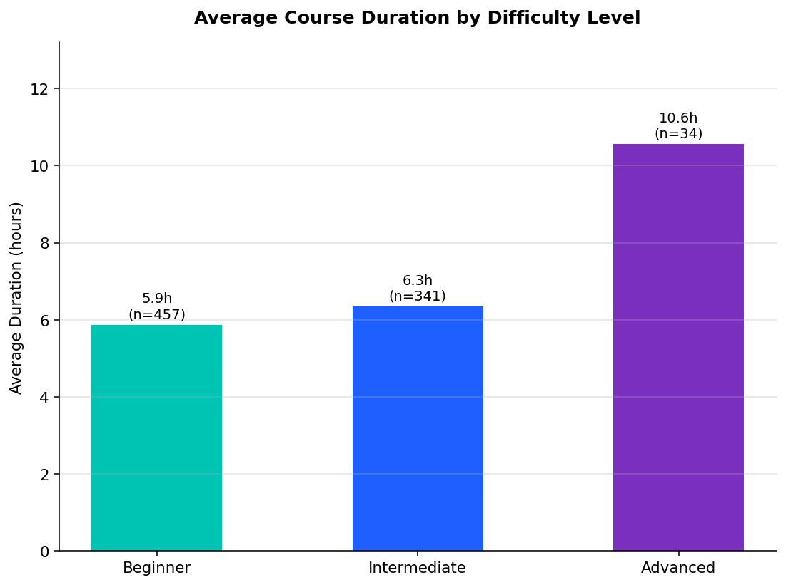
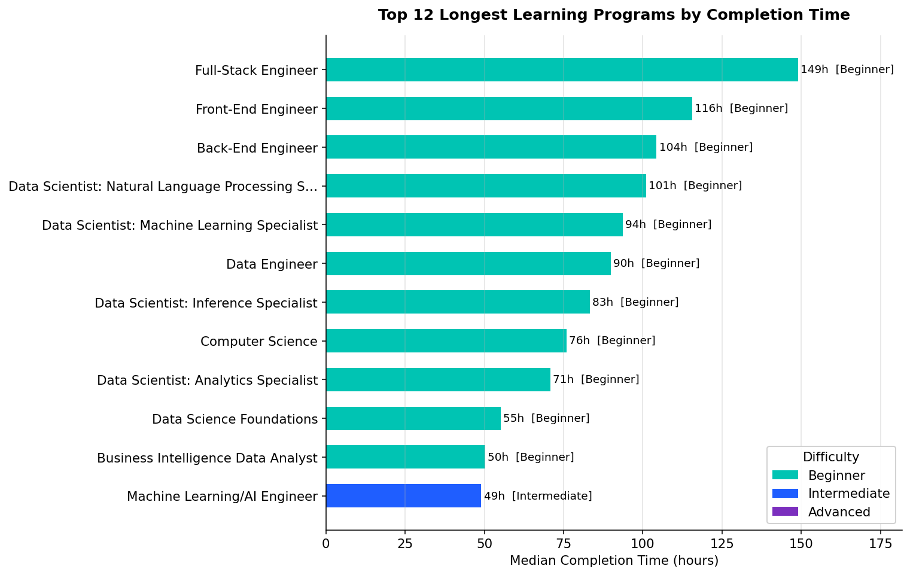
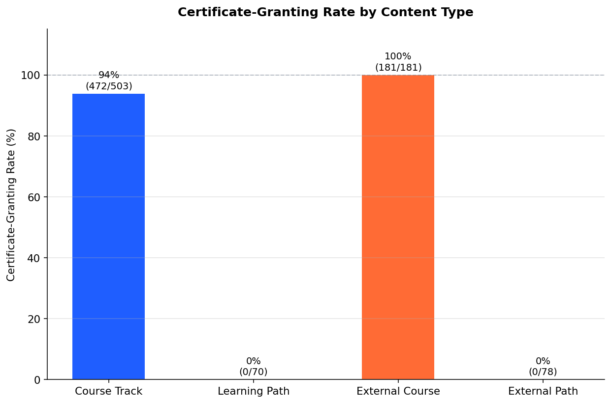
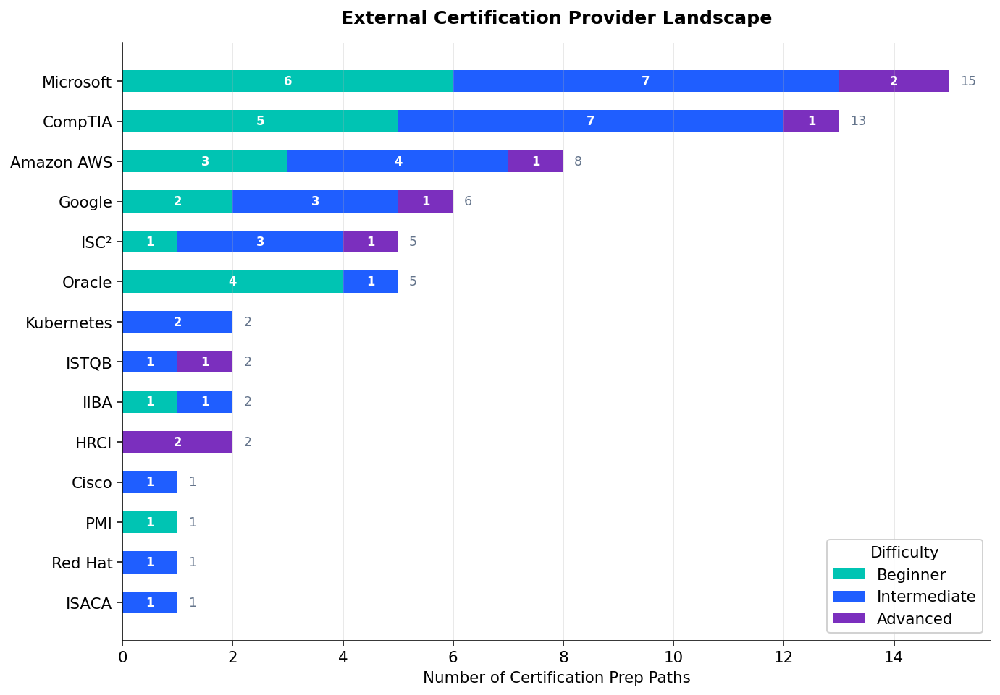
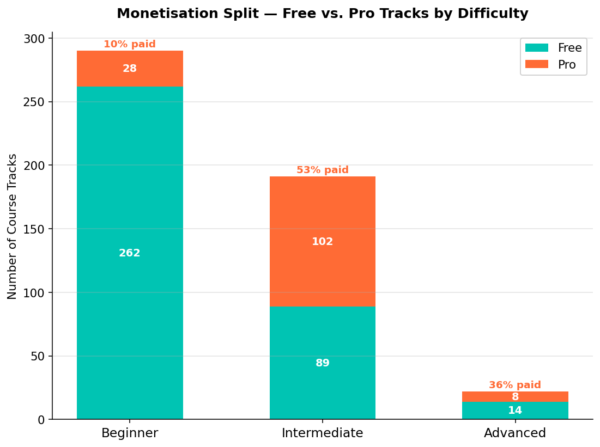

# Codecademy Catalog — Business Intelligence Report

- > **Audience:** Executives, Product Owners, Business Managers
- > **Data source:** Codecademy public course catalog — 832 offerings
- > **Report date:** February 2026

---

## Executive Summary

Codecademy's catalog of **832 learning offerings** reveals a platform built primarily around accessible, entry-level content with a clear but unevenly deployed monetisation strategy. The majority of offerings are short (under 5 hours), free to access, and beginner-facing. However, the paid tier is heavily concentrated at the **Intermediate level** — an intentional premium positioning that leaves significant monetisation opportunity untapped at the Beginner and Advanced ends of the spectrum. Meanwhile, the external certification partnership program is small but dominated by Microsoft and CompTIA, signalling a high-value segment worth strategic investment.

---

## 1. What Is Codecademy Actually Selling?

The catalog is made up of four content types. **Course Tracks** (503 offerings) are the backbone of the platform — structured, multi-lesson programs covering a single skill or technology. **Learning Paths** (70) and **External Paths** (78) bundle multiple tracks into career-level journeys. **External Courses** (181) are third-party content integrated into the catalog.

**Key observation:** Course Tracks and External Courses together account for **82% of the catalog** and are overwhelmingly Beginner-focused. Learning Paths and External Paths skew more toward Intermediate learners — reflecting their role as multi-step progression products rather than entry points.

**Business implication:** The top of the funnel (Beginner, high volume, free) is well-stocked. The progression layer — content that converts casual learners into paying subscribers by offering structured career advancement — is comparatively thin.

---

## 2. The Monetisation Gap at the Extremes

Among Course Tracks specifically, the split between free and paid (Pro) content tells a clear story:

| Difficulty    | Pro Tracks | Free Tracks | % Paid |
|---------------|-----------|-------------|--------|
| Beginner      | 28        | 290         | **10%** |
| Intermediate  | 102       | 167         | **53%** |
| Advanced      | 8         | 22          | **36%** |

The Intermediate tier is where Codecademy concentrates its paid offering. This is strategically sound — learners who have already invested time and moved past beginner content have demonstrated intent and are more likely to pay. However, **only 10% of Beginner content carries a paywall**, and **only 36% of Advanced content is monetised**, indicating two underexplored revenue zones.

**Business implication:** The Advanced tier — high-skill, lower-volume — may support premium pricing. Consider whether expanding paid Advanced content (currently only 8 Pro tracks) could unlock a higher-ARPU segment.

---

## 3. Most Courses Are Very Short — A Double-Edged Sword

**75% of all offerings require less than 5 hours to complete.** Only 9 offerings exceed 60 hours.

This reflects a deliberate product design — short, completable modules lower the barrier to entry and are easy to share and recommend. However, short courses also create a lower perceived value ceiling, which may limit willingness to pay.

**Business implication:** Short content drives engagement metrics (completion rates, daily active users) but can constrain subscription justification. The 108 offerings in the 5–30 hour range represent the "substantial but achievable" sweet spot — this range may correlate more directly with subscription conversion and retention. Tracking completion and churn rates by duration bucket would confirm this hypothesis.

---

## 4. Beginner Courses Are Longer Than Harder Ones

On average, Beginner offerings are **6.4 hours** — nearly double the 3.3-hour average for Advanced offerings. This counterintuitive pattern is explained by Beginner-tier flagship career programs (e.g., *Full-Stack Engineer* at 149 hours, *Front-End Engineer* at 115 hours) which inflate the average significantly.

**Business implication:** The Beginner category contains both 1-hour micro-courses and 100+ hour career programs. Presenting these identically in the catalog creates a confusing customer experience. A clear product segmentation between "skill introductions" and "career programs" at the Beginner level would help learners select the right commitment level — and help the business align pricing, marketing, and retention expectations accordingly.

---

## 5. Codecademy's Flagship Career Programs Are Massive Commitments

The 12 longest programs range from **38 to 149 hours** and are almost entirely tagged as *Beginner* — meaning these are zero-to-employable career transformation products, not advanced specializations. The top five are:

| Program | Duration |
|---------|----------|
| Full-Stack Engineer | 149 hours |
| Front-End Engineer | 115 hours |
| Back-End Engineer | 104 hours |
| Data Scientist: NLP Specialist | 101 hours |
| Data Scientist: ML Specialist | 94 hours |

These are the products most analogous to a bootcamp or a degree program. At 100+ hours of content, they require weeks or months of sustained engagement — making them the strongest candidates for subscription lock-in and annual plan upsells.

**Business implication:** These long-form programs are likely the primary driver of subscription renewals. Tracking whether learners who start these programs convert to annual plans at higher rates than those starting short courses would directly inform acquisition and onboarding strategy.

---

## 6. Certification Is a Near-Universal Outcome

Across all content types, the certificate-granting rate is strikingly high:

- **Course Tracks:** 93% grant a certificate
- **External Courses:** 100% grant a certificate
- **Learning Paths & External Paths:** certificates are not applicable (not tracked in this field)

**Business implication:** Certificates are effectively table stakes on this platform — they are not a differentiator. The value question shifts to: *how recognized are these certificates by employers?* Investing in employer partnerships, verifiable credentials (e.g., blockchain-backed or LinkedIn-integrated certificates), or co-branding with external certification bodies could convert certificate completion from a feature into a competitive advantage.

---

## 7. External Certification Partnerships: A Small but High-Value Segment

Codecademy has partnered with **14 external certification bodies** to offer prep paths for industry-recognized credentials. Microsoft (15 paths) and CompTIA (13 paths) dominate. AWS (8), Google (6), and ISC² (5) round out the top five.

These external certification paths are categorized as either "Certification Paths" (64) or "Journeys" (14). They serve a fundamentally different buyer than the standard catalog — **professional learners with a specific credential target and real career consequences**, rather than exploratory learners.

**Business implication:** Learners pursuing Microsoft Azure, AWS Solutions Architect, or CompTIA Security+ certifications have high purchase intent and are likely to tolerate premium pricing. This segment warrants dedicated marketing, potentially a separate subscription tier (e.g., a "Certification Pro" plan), and deeper co-marketing with the certification bodies themselves. Expanding partnerships with underrepresented but high-demand providers (e.g., Cisco, Google Cloud) is a low-risk growth lever.

---

## 8. The Monetisation Funnel at a Glance

This chart consolidates the monetisation story: among the 503 Course Tracks, 365 are free and 138 are paid. The paid offering is structurally concentrated at Intermediate difficulty, while both the high-volume Beginner tier and the high-skill Advanced tier remain predominantly free.

**Three strategic questions this raises:**

1. **Beginner-to-Intermediate conversion:** Are the 290 free Beginner tracks effectively funnelling learners toward the 102 paid Intermediate tracks? Conversion rate data between these tiers would reveal whether the free-first strategy is working.

2. **Advanced content investment:** With only 30 Advanced tracks total (8 paid, 22 free), is there unmet demand for expert-level content that could command a specialist pricing tier?

3. **Path to first purchase:** For learners who never reach the Intermediate tier, what is the current monetisation path? If there is none, the 290 free Beginner tracks represent a large segment with no conversion mechanism.

---

## Summary of Key Decisions This Data Can Inform

| Business Question | Relevant Finding |
|---|---|
| Where should we expand the paid catalog? | Advanced tier is under-monetised (36% paid vs. 53% at Intermediate) |
| What is our highest-value learner segment? | Learners on 100h+ career programs — likely highest LTV and renewal candidates |
| How should we price certifications? | External cert prep is a distinct, high-intent segment — consider a premium tier |
| Is our content pipeline balanced? | Advanced content is thin (34 total offerings, 4% of catalog) — a gap vs. learner progression |
| How do we differentiate our certificates? | 93–100% cert-granting rate makes certs a commodity — employer partnerships needed |
| What acquisition channels align with content? | Short (<5h) free Beginner content = top-of-funnel acquisition; 100h programs = retention |

---

*Data collected February 2026 from the Codecademy public course catalog API.*
