```mermaid
graph TB
    subgraph "Input Processing"
        A[384×384 Image] --> B[Split into Patches]
        B --> C[16×16 patches<br/>576 total patches]
    end

    subgraph "Vision Transformer Encoder"
        C --> D[Patch Embeddings]
        D --> E[12 Transformer Layers]
        E --> F[Visual Features]
    end

    subgraph "Text Decoder"
        F --> G[6 Transformer Layers]
        G --> H[Generate Text Token by Token]
        H --> I[Beam Search<br/>Find best sequence]
    end

    I --> J[📝 Final Text + Confidence Score]

    style A fill:#e1f5ff
    style F fill:#fff4e1
    style J fill:#e8f5e9
```

```mermaid
graph TB
    subgraph "Input Stage"
        A[Document Image] --> B[Resize to 1280×960]
    end

    subgraph "Vision Encoder - Swin Transformer"
        B --> C[Stage 1: 320×240]
        C --> D[Stage 2: 160×120]
        D --> E[Stage 3: 80×60]
        E --> F[Stage 4: 40×30]
        F --> G[Hierarchical Visual Features]
    end

    subgraph "Task Prompt"
        H["<s_docvqa><s_question>Extract fields</s_question><s_answer>"]
    end

    subgraph "Text Decoder - mBART"
        G --> I[Cross Attention<br/>Image ↔ Text]
        H --> I
        I --> J[Autoregressive Generation]
        J --> K[Generate JSON Token by Token]
    end

    K --> L[Structured Output]

    style A fill:#e1f5ff
    style G fill:#fff4e1
    style L fill:#e8f5e9
```

# 📖 Complete Beginner's Guide to Handwriting OCR Models

> **This guide explains EVERYTHING from scratch - no prior ML knowledge required!**

## Table of Contents
1. [The Problem We're Solving](#the-problem)
2. [Understanding OCR - The Basics](#understanding-ocr)
3. [Why Multiple Models?](#why-multiple-models)
4. [Model 1: TrOCR - The Traditional Approach](#model-1-trocr)
5. [Model 2: Donut - The Revolutionary Approach](#model-2-donut)
6. [Model 3: LayoutLMv3 - The Smart Approach](#model-3-layoutlmv3)
7. [The Ensemble - Combining Powers](#the-ensemble)
8. [Visual Data Flow](#visual-data-flow)
9. [Alternatives & Why We Chose These](#alternatives)
10. [When to Use What](#when-to-use-what)

---

## The Problem

### What are we trying to solve?

Imagine you have **thousands of handwritten documents** from SOCAR's archives:
- 📄 Employee forms filled by hand
- 📝 Field notes from engineers
- 📋 Old reports with handwritten annotations
- 📊 Tables with handwritten numbers

**Current situation**:
- Someone must manually type all this information → **SLOW** ⏰
- Humans make mistakes when typing → **ERRORS** ❌
- Cannot search through handwritten documents → **UNUSABLE** 🔍

**What we want**:
- Automatically convert handwriting to digital text → **FAST** ⚡
- Extract structured information (names, dates, numbers) → **ORGANIZED** 📊
- Make all documents searchable → **ACCESSIBLE** ✅

---

## Understanding OCR

### What is OCR?

**OCR = Optical Character Recognition**

Think of it like teaching a computer to "read" text from images.

```mermaid
graph LR
    A[📄 Image of Text] --> B[🤖 OCR System]
    B --> C[📝 Digital Text]

    style A fill:#e1f5ff
    style B fill:#fff4e1
    style C fill:#e8f5e9
```



### Traditional OCR (Old Way)

**How it worked**:
1. Find where letters are in the image
2. Match each letter shape to known patterns
3. Combine letters into words

**Problem**: Handwriting is messy! Everyone writes differently.


### Modern OCR (New Way - Using AI)

Instead of rules, we use **Deep Learning** (AI that learns from examples).

**Analogy**:
- Traditional OCR = Following a recipe exactly
- AI OCR = Learning to cook by watching thousands of chefs


---

## Why Multiple Models?

### The Restaurant Analogy

Imagine you want the best meal. Which is better?

**Option 1**: One chef (single model)
- ✅ Simple
- ❌ If chef has bad day, meal is bad
- ❌ Limited to one cooking style

**Option 2**: Three specialized chefs (multiple models)
- Chef 1: Amazing at grilling 🍖
- Chef 2: Perfect pasta maker 🍝
- Chef 3: Dessert specialist 🍰
- ✅ Each handles what they're best at
- ✅ If one makes mistake, others compensate

**Our approach**: Use 3 specialized models, combine their strengths!


---

## Model 1: TrOCR

### What is TrOCR?

**TrOCR = Transformer-based Optical Character Recognition**

**In Simple Terms**: It's like having a student who:
1. **Looks** at the handwriting very carefully (Vision part)
2. **Thinks** about what letters make sense (Language part)
3. **Writes** out the text character by character

### How TrOCR Works - Step by Step

```mermaid
graph TD
    A[📷 Image of Handwritten Line] --> B[Vision Encoder<br/>Looks at image]
    B --> C[Understands:<br/>shapes, strokes, patterns]
    C --> D[Text Decoder<br/>Generates text]
    D --> E[Output: 'Hello World']

    style A fill:#e1f5ff
    style B fill:#fff4e1
    style C fill:#ffe1e1
    style D fill:#fff4e1
    style E fill:#e8f5e9

    B -.->|What it sees| F["Curved line,<br/>vertical line,<br/>two dots"]
    D -.->|Translates to| G['H', 'e', 'l', 'l', 'o']
```



### Real Example

**Input**: Image of handwritten word "SOCAR"

**What TrOCR does**:
```
Step 1: Vision Encoder sees →  [Curved shape] [Circle] [Curved shape] [Triangle] [Curved shape]
Step 2: Decoder thinks →       "This looks like S-O-C-A-R"
Step 3: Output →                "SOCAR"
```

### Architecture Details



### Strengths & Weaknesses

**Strengths** ✅:
- Very accurate on **clean, clear handwriting** (3-5% error rate)
- **Fast** - processes a line in ~50 milliseconds
- Works well on **consistent writing styles**
- Good at **character-level accuracy**

**Weaknesses** ❌:
- Needs **line-by-line input** (must segment document first)
- Struggles with **very messy handwriting**
- Doesn't understand **document structure** (forms, tables)
- Sensitive to **poor image quality**

### When to Use TrOCR

✅ **Good for**:
- Clean handwritten notes
- Consistent writing style
- Line-by-line text
- When speed is important

❌ **Not good for**:
- Very messy writing
- Complex forms with tables
- Low-quality scans
- Mixed content (text + graphics)

---

## Model 2: Donut

### What is Donut?

**Donut = Document understanding transformer**

**In Simple Terms**: Donut is like a detective who:
1. **Looks at the ENTIRE document** at once (not line by line)
2. **Understands the structure** (this is a form, this is a table)
3. **Directly extracts information** without reading every letter

### The Revolutionary Idea: OCR-Free

**Traditional approach** (TrOCR):
```
Image → Read all text → Find important fields → Extract info
```

**Donut's approach**:
```
Image → Directly extract what you need
```

**Analogy**:
- TrOCR = Reading entire newspaper to find weather forecast
- Donut = Looking directly at weather section

### How Donut Works

```mermaid
graph TD
    A[📄 Full Document Image<br/>1280×960] --> B[Vision Encoder<br/>Swin Transformer]

    B --> C[Understands Layout:<br/>Title, Fields, Tables]

    C --> D[Text Decoder]

    E[Question:<br/>'Extract all fields'] --> D

    D --> F[Generates Structured Output]

    F --> G["JSON Output:<br/>{<br/>  'name': 'John',<br/>  'date': '13/12/2025'<br/>}"]

    style A fill:#e1f5ff
    style B fill:#fff4e1
    style C fill:#ffe1e1
    style D fill:#fff4e1
    style G fill:#e8f5e9
```



### Real Example

**Input**: Image of a form

**What Donut does**:
```
❌ OLD WAY (Traditional OCR):
1. Read: "Name: John Doe"
2. Read: "Date: 13/12/2025"
3. Read: "Department: Engineering"
4. Then extract fields

✅ DONUT WAY:
Directly outputs:
{
  "name": "John Doe",
  "date": "13/12/2025",
  "department": "Engineering"
}
```

### Architecture Details



### Strengths & Weaknesses

**Strengths** ✅:
- Works on **messy, low-quality images**
- Understands **document structure** (forms, tables)
- **OCR-free** - no need for separate text recognition
- Good at **structured information extraction**
- Handles **mixed content** (text + graphics)

**Weaknesses** ❌:
- **Slower** than TrOCR (~200ms per page)
- Needs **more training data** for new document types
- **Larger model** (requires more GPU memory - 4GB+)
- Less accurate on **pure text paragraphs**

### When to Use Donut

✅ **Good for**:
- Forms with fields to extract
- Documents with tables
- Mixed handwritten + printed text
- When you know what fields you want

❌ **Not good for**:
- Pure text transcription
- When speed is critical
- Very long documents
- When you need character-level precision

---

## Model 3: LayoutLMv3

### What is LayoutLMv3?

**LayoutLM = Layout Language Model version 3**

**In Simple Terms**: LayoutLMv3 is like a smart assistant who:
1. **Reads the text** (using OCR results)
2. **Sees where text is positioned** (layout)
3. **Looks at visual features** (images, styles)
4. **Combines all three** to understand meaning

### The Three-Input Approach

Most models use ONE type of input. LayoutLMv3 uses THREE!


### Why Position Matters

**Example**: The word "Total"

```
Position 1 (top of page): "Total: 5 items"    → Header
Position 2 (bottom-right): "Total: $500"      → Amount to pay
Position 3 (middle-left):  "Total sales"      → Column label
```

Same word, different meanings based on **position**!

### How LayoutLMv3 Works


### Real Example

**Input**:
- Text: "John", "Doe", "13/12/2025"
- Positions: (100,50), (200,50), (100,100)
- Visual: Bold font, Normal font, Normal font

**What LayoutLMv3 does**:
```
Analysis:
- "John" at (100,50) with bold font → First name
- "Doe" at (200,50) normal → Last name (comes after first name)
- "13/12/2025" at (100,100) → Date (DD/MM/YYYY format)

Output:
{
  "first_name": "John",
  "last_name": "Doe",
  "date": "13/12/2025"
}
```

### Architecture Details


### The BIO Tagging System

LayoutLMv3 uses **BIO tagging** to mark entities:

- **B** = Beginning of entity
- **I** = Inside entity
- **O** = Outside (not an entity)

**Example**:
```
Text:     Name:    John    Doe     Date:   13/12/2025
Tags:     O        B-NAME  I-NAME  O       B-DATE
```

This tells the system: "John Doe" is ONE name, not two separate things!

### Strengths & Weaknesses

**Strengths** ✅:
- **Best understanding** of document structure
- **Context-aware** - knows relationships between fields
- **Accurate entity extraction** (F1 score ~0.91)
- Works well on **complex layouts** (tables, forms)
- **Combines** text, position, and visual info

**Weaknesses** ❌:
- **Requires OCR** - depends on TrOCR/Tesseract first
- **More complex** to train and deploy
- **Slower** than TrOCR alone
- Needs **good bounding boxes** for positions

### When to Use LayoutLMv3

✅ **Good for**:
- Forms with many fields
- Documents with tables
- When you need to understand relationships
- Named entity recognition (NER)

❌ **Not good for**:
- Simple text transcription
- When OCR is unavailable
- Real-time applications (slower)

---

## The Ensemble

### Why Combine Models?

**Question**: If we have 3 models, why not just use the best one?

**Answer**: Each model is good at different things!


### Ensemble Strategies

We have **3 ways** to combine models:

#### 1. Voting (Democracy)

**How it works**: Each model votes, majority wins!


**Pros**: Simple, fair
**Cons**: Ignores confidence (what if one model is very sure?)

#### 2. Weighted (Expert Opinion)

**How it works**: Give more weight to models we trust more!

```mermaid
graph TD
    A["TrOCR: 'John'<br/>Confidence: 90%<br/>Weight: 30%"] --> D[Calculate Scores]
    B["Donut: 'John'<br/>Confidence: 85%<br/>Weight: 40%"] --> D
    C["LayoutLM: 'Joan'<br/>Confidence: 60%<br/>Weight: 30%"] --> D

    D --> E["Score for 'John':<br/>0.3×0.9 + 0.4×0.85 = 0.61"]
    D --> F["Score for 'Joan':<br/>0.3×0.6 = 0.18"]

    E --> G["Winner: 'John'<br/>(higher score)"]

    style G fill:#c8e6c9
```



**Pros**: Considers confidence, flexible
**Cons**: Need to tune weights

**Our weights**:
- TrOCR: 30% (good for clean text)
- Donut: 40% (most robust)
- LayoutLMv3: 30% (best for structure)

#### 3. Cascaded (Fallback Chain)

**How it works**: Try best model first, if not confident, try next!


**Pros**: Fast when first model works
**Cons**: Might miss better answer from other models

### Our Choice: Weighted Ensemble ⭐

We use **weighted ensemble** because:
1. Considers all models (doesn't ignore any)
2. Weighs by confidence (trusts confident predictions)
3. Flexible (can adjust weights for different document types)
4. Best accuracy in practice

---

## Visual Data Flow

### Complete Pipeline with All Details

```mermaid
graph TB
    subgraph "1️⃣ Input Stage"
        A[📷 Document Image<br/>JPG/PNG/PDF] --> B{File Type?}
        B -->|PDF| C[PDF to Image<br/>Conversion]
        B -->|Image| D[Load Image]
        C --> D
    end

    subgraph "2️⃣ Preprocessing - 50-100ms"
        D --> E[Check Quality]
        E -->|Low Quality| F[Enhance<br/>Contrast, Denoise]
        E -->|Good Quality| G[Deskew]
        F --> G

        G --> H[Convert to Grayscale]
        H --> I[Binarization<br/>Sauvola Thresholding]
        I --> J[Layout Detection<br/>Find text regions]
        J --> K[Line Segmentation<br/>Split into lines]
    end

    subgraph "3️⃣ Parallel Model Inference - 300-400ms"
        K --> L[TrOCR Path]
        K --> M[Donut Path]
        K --> N[LayoutLMv3 Path]

        L --> L1[For each line]
        L1 --> L2[Vision Encoder]
        L2 --> L3[Text Decoder]
        L3 --> L4["Result 1<br/>Text + Confidence"]

        M --> M1[Full page image]
        M1 --> M2[Swin Encoder]
        M2 --> M3[JSON Decoder]
        M3 --> M4["Result 2<br/>Fields + Confidence"]

        N --> N1[Get OCR text]
        N1 --> N2[Get positions]
        N2 --> N3[Multimodal Fusion]
        N3 --> N4["Result 3<br/>Entities + Confidence"]
    end

    subgraph "4️⃣ Ensemble - 20ms"
        L4 --> O[Align Results<br/>Match overlapping fields]
        M4 --> O
        N4 --> O

        O --> P[Calculate Weighted Scores]
        P --> Q[Resolve Conflicts<br/>Choose best for each field]
        Q --> R[Combined Result]
    end

    subgraph "5️⃣ Post-processing - 20ms"
        R --> S[Spell Check]
        S --> T[Lexicon Matching<br/>SOCAR vocabulary]
        T --> U[Format Validation<br/>Dates, numbers]
        U --> V[Confidence Filtering<br/>Flag low confidence]
    end

    subgraph "6️⃣ Output"
        V --> W["📊 Structured JSON<br/>{<br/>  'name': 'John',<br/>  'date': '13/12/25',<br/>  'confidence': 0.95<br/>}"]
    end

    style A fill:#e3f2fd
    style I fill:#fff9c4
    style L4 fill:#f3e5f5
    style M4 fill:#f3e5f5
    style N4 fill:#f3e5f5
    style R fill:#e1f5fe
    style W fill:#c8e6c9
```



### Detailed Data Transformation

Let's follow ONE document through the entire pipeline:

```mermaid
graph TB
    A["📄 INPUT<br/>Handwritten form image<br/>3000×2000 pixels"] --> B["🔧 PREPROCESSING<br/>Result:<br/>- Deskewed<br/>- Binarized<br/>- 5 text regions detected<br/>- 12 lines segmented"]

    B --> C1["🤖 TrOCR<br/>Line 1: 'Name: John Doe' (95%)<br/>Line 2: 'Date: 13/12/2025' (92%)<br/>Line 3: 'Dept: Engineering' (88%)"]

    B --> C2["🤖 DONUT<br/>Fields:<br/>{<br/>  'name': 'John Doe' (90%),<br/>  'date': '13-12-2025' (85%),<br/>  'department': 'Engineering' (87%)<br/>}"]

    B --> C3["🤖 LAYOUTLMV3<br/>Entities:<br/>- B-NAME: 'John' (93%)<br/>- I-NAME: 'Doe' (93%)<br/>- B-DATE: '13/12/2025' (91%)<br/>- B-DEPT: 'Engineering' (89%)"]

    C1 --> D["⚖️ ENSEMBLE<br/>Weighted combination:<br/>- Name: 'John Doe'<br/>  TrOCR: 0.3×0.95 = 0.285<br/>  Donut: 0.4×0.90 = 0.360<br/>  LayoutLM: 0.3×0.93 = 0.279<br/>  TOTAL = 0.924<br/><br/>- Date: '13/12/2025'<br/>  TOTAL = 0.896"]

    C2 --> D
    C3 --> D

    D --> E["🎯 POST-PROCESSING<br/>- Spell checked ✓<br/>- Date validated ✓<br/>- Confidence > threshold ✓"]

    E --> F["📊 OUTPUT<br/>{<br/>  'name': 'John Doe',<br/>  'name_confidence': 0.92,<br/>  'date': '13/12/2025',<br/>  'date_confidence': 0.90,<br/>  'department': 'Engineering',<br/>  'dept_confidence': 0.88,<br/>  'overall_confidence': 0.90<br/>}"]

    style A fill:#e3f2fd
    style B fill:#fff9c4
    style C1 fill:#f3e5f5
    style C2 fill:#f3e5f5
    style C3 fill:#f3e5f5
    style D fill:#e1f5fe
    style E fill:#fff3e0
    style F fill:#c8e6c9
```



### Performance Breakdown


**Total Time**: ~340ms (0.34 seconds) per document

---

## Alternatives

### What ELSE Could We Use?

#### Alternative 1: Tesseract OCR (Traditional)


**What it is**: Old-school OCR using pattern matching

**Pros**:
- ✅ Free and open source
- ✅ Very fast
- ✅ Supports many languages

**Cons**:
- ❌ Bad with handwriting (15-30% error rate!)
- ❌ No structure understanding
- ❌ Sensitive to image quality

**Why we didn't use it**: Too inaccurate for handwriting

#### Alternative 2: EasyOCR


**What it is**: Modern OCR with deep learning, easier to use

**Pros**:
- ✅ Better than Tesseract
- ✅ Simple API
- ✅ Multiple languages

**Cons**:
- ❌ Still struggles with messy handwriting (8-12% error)
- ❌ No document understanding
- ❌ Single model (no ensemble benefits)

**Why we didn't use it**: Not as accurate as TrOCR for handwriting

#### Alternative 3: Google Cloud Vision / AWS Textract (Cloud Services)

```mermaid
graph LR
    A[Image] --> B[Upload to Cloud]
    B --> C[Google/AWS API]
    C --> D[Results]

    style A fill:#e1f5ff
    style B fill:#ffe082
    style C fill:#ffe082
    style D fill:#e8f5e9
```

**What it is**: Pay-per-use cloud OCR services

**Pros**:
- ✅ Very accurate (trained on massive data)
- ✅ No need to manage models
- ✅ Good support

**Cons**:
- ❌ **COSTS MONEY** (important for hackathon!)
- ❌ Requires internet connection
- ❌ Privacy concerns (data goes to cloud)
- ❌ Can't customize for SOCAR-specific needs

**Why we didn't use it**: Cost + privacy + can't customize

#### Alternative 4: Single Large Model (GPT-4 Vision)

```mermaid
graph LR
    A[Image] --> B[GPT-4 Vision]
    B --> C[Extracted Data]

    style A fill:#e1f5ff
    style B fill:#ce93d8
    style C fill:#e8f5e9
```

**What it is**: Use huge multimodal LLM for everything

**Pros**:
- ✅ Very smart, understands context
- ✅ One model does everything
- ✅ Can handle unusual cases

**Cons**:
- ❌ **VERY EXPENSIVE** ($0.01 per image!)
- ❌ Slow (5-10 seconds per image)
- ❌ Requires API access
- ❌ Not specialized for OCR

**Why we didn't use it**: Too expensive and slow for production

### Comparison Table

| Approach | Accuracy | Speed | Cost | Customizable | Offline |
|----------|----------|-------|------|--------------|---------|
| **Our Ensemble** | ⭐⭐⭐⭐⭐ | ⭐⭐⭐ | ✅ Free | ✅ Yes | ✅ Yes |
| Tesseract | ⭐ | ⭐⭐⭐⭐⭐ | ✅ Free | ⭐⭐ | ✅ Yes |
| EasyOCR | ⭐⭐⭐ | ⭐⭐⭐⭐ | ✅ Free | ⭐⭐⭐ | ✅ Yes |
| Cloud APIs | ⭐⭐⭐⭐ | ⭐⭐⭐ | ❌ Paid | ❌ No | ❌ No |
| GPT-4V | ⭐⭐⭐⭐ | ⭐ | ❌ Very Expensive | ❌ No | ❌ No |

---

## When to Use What

### Decision Tree

```mermaid
graph TD
    A[I have a handwritten document] --> B{What type?}

    B -->|Simple text| C{Is it clean?}
    B -->|Form with fields| D[Use Donut]
    B -->|Complex layout| E[Use LayoutLMv3]
    B -->|Don't know| F[Use Ensemble]

    C -->|Yes, clean| G[Use TrOCR]
    C -->|No, messy| H[Use Donut or Ensemble]

    D --> I{Need high accuracy?}
    E --> I

    I -->|Yes| F
    I -->|Speed matters| J[Use single best model]

    style F fill:#c8e6c9
    style G fill:#bbdefb
    style D fill:#f8bbd0
    style E fill:#fff9c4
```

### Scenarios

#### Scenario 1: Clean Handwritten Letter
**Use**: TrOCR only
**Why**: Fast and accurate enough
**Example**: Engineer's notes

#### Scenario 2: Filled Form
**Use**: Donut
**Why**: Direct field extraction
**Example**: Employee registration form

#### Scenario 3: Complex Document
**Use**: LayoutLMv3
**Why**: Best at understanding structure
**Example**: Invoice with table

#### Scenario 4: Production System (SOCAR)
**Use**: Ensemble (all three)
**Why**: Need highest accuracy, can't afford mistakes
**Example**: All incoming documents

### Quick Reference

```mermaid
graph LR
    subgraph "Document Types"
        A[Clean Text] --> E[TrOCR]
        B[Form] --> F[Donut]
        C[Complex Layout] --> G[LayoutLMv3]
        D[Mixed/Unknown] --> H[Ensemble]
    end

    subgraph "Priority"
        I[Speed] --> E
        J[Accuracy] --> H
        K[Structure] --> G
        L[Robustness] --> F
    end

    style E fill:#bbdefb
    style F fill:#f8bbd0
    style G fill:#fff9c4
    style H fill:#c8e6c9
```

---

## Summary: The Big Picture

### What We Built

```mermaid
mindmap
  root((Handwriting<br/>OCR System))
    Preprocessing
      Deskew
      Denoise
      Binarize
      Segment
    Models
      TrOCR
        Clean text
        Fast
      Donut
        OCR-free
        Robust
      LayoutLMv3
        Multimodal
        Context-aware
    Ensemble
      Voting
      Weighted
      Cascaded
    Output
      JSON
      Confidence
      Validation
```

### Key Concepts to Remember

1. **OCR** = Teaching computers to read text from images
2. **Deep Learning** = AI that learns from examples (not rules)
3. **Transformer** = Modern AI architecture that's very good at sequences
4. **Ensemble** = Combining multiple models for better accuracy
5. **Multimodal** = Using different types of input (text + position + image)

### Why Our Approach is Good

```mermaid
graph TD
    A[Single Model<br/>50-80% might fail] --> B[Ensemble<br/>5-10% fail]

    C[No preprocessing<br/>High error rate] --> D[Smart preprocessing<br/>Lower error rate]

    E[No confidence scores<br/>Don't know quality] --> F[Confidence tracking<br/>Know what to trust]

    style B fill:#c8e6c9
    style D fill:#c8e6c9
    style F fill:#c8e6c9
```

### Final Analogy

Think of our system like a **medical diagnosis**:

1. **Preprocessing** = Nurse takes measurements (temperature, blood pressure)
2. **TrOCR** = General practitioner looks at symptoms
3. **Donut** = Specialist looks at X-rays
4. **LayoutLMv3** = Lab technician analyzes blood tests
5. **Ensemble** = Three doctors discuss and agree on diagnosis
6. **Post-processing** = Verify diagnosis against medical database

Just like you'd trust 3 doctors more than 1, our ensemble is more reliable!

---

## Next Steps

Now that you understand the models, you can:

1. **Experiment**: Try different models on your data
2. **Customize**: Adjust ensemble weights for your needs
3. **Extend**: Add new models to the ensemble
4. **Optimize**: Fine-tune models on SOCAR-specific data

---

**Questions to test understanding**:

1. Why do we use 3 models instead of 1? *(Answer: Different strengths, ensemble more accurate)*
2. When would you use TrOCR alone? *(Answer: Clean handwriting, need speed)*
3. What makes Donut "OCR-free"? *(Answer: Doesn't read text first, directly extracts fields)*
4. Why does LayoutLMv3 need position information? *(Answer: Same text means different things in different positions)*
5. What ensemble strategy do we use? *(Answer: Weighted, considers confidence)*

---

**Made with ❤️ for SOCAR Hackathon 2025**

*Remember: You don't need to be an AI expert to use this system - just understand when to use what model!*
